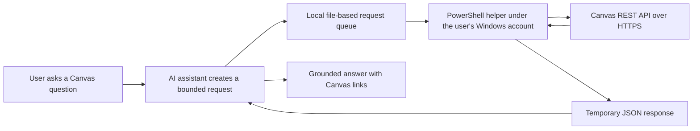

# Canvas Coursework Assistant

A local, read-only bridge that lets an AI coding assistant answer questions about a student's Canvas coursework on demand—without placing a Canvas API token in chat, prompts, source control, or a plaintext configuration file.

## Purpose

Canvas Coursework Assistant was built to reduce the friction of checking assignments, readings, modules, announcements, and deadlines across multiple classes. A user can ask natural-language questions such as:

- What is due tomorrow?
- Do I have any exams this week?
- What should I prepare for Thursday's class?
- Pull the requirements for my ERD assignment.

The project keeps authentication local while giving the assistant access to fresh, structured Canvas data. It is designed for personal productivity and portfolio demonstration; it does not submit work, change course data, or send messages.

## How it works



1. The Canvas access token is entered through a hidden PowerShell prompt and encrypted with Windows Data Protection through `Export-Clixml`.
2. A background helper runs under the same Windows account, allowing it to decrypt the token in memory.
3. The assistant writes a short-lived request to a local queue.
4. The helper validates the request against a strict allowlist, performs an HTTPS `GET` request to Miami University's Canvas API, and returns JSON.
5. The client reads and removes the response after use.

No local web server or listening port is opened.

## Tech stack

- **PowerShell 7 / Windows PowerShell** — helper, validation, request queue, and Canvas client
- **Canvas LMS REST API** — courses, assignments, modules, pages, announcements, and planner data
- **Windows DPAPI-backed secure strings** — user-scoped token encryption at rest
- **JSON** — short-lived request and response messages
- **Git/GitHub** — source control and portfolio documentation
- **Mermaid** — architecture diagram

## Security design

- Read-only HTTP `GET` requests only
- HTTPS requests restricted to `miamioh.instructure.com`
- Explicit allowlist of supported Canvas API routes and query parameters
- Cross-host pagination links rejected
- Token never returned in responses or written to logs
- No network listener; communication uses a local directory
- Request IDs, expiration checks, file-size limits, and response cleanup
- Secrets, course exports, local response files, and Windows shortcuts excluded from Git

This is a personal project, not an official Miami University or Instructure product. Anyone adapting it for another Canvas institution should update the allowed hostname and review the endpoint allowlist.

## Repository structure

```text
outputs/
  Ask-Canvas.ps1          # submits a validated local request and waits for JSON
  Canvas-Bridge-Core.ps1  # route validation, pagination, and shared utilities
  Canvas-Helper.ps1       # background helper that holds credentials in memory
  Connect-Canvas.ps1      # one-time secure token setup
  Stop-Canvas-Helper.ps1  # graceful stop signal
  Canvas Helper.md        # operating notes
work/
  (runtime files; ignored by Git)
```

## Local setup

1. Generate a personal Canvas access token from your Canvas account settings.
2. Run `outputs/Connect-Canvas.ps1` and paste the token into the hidden prompt.
3. Start `outputs/Canvas-Helper.ps1` under the same Windows account.
4. Make a read-only request:

```powershell
& './outputs/Ask-Canvas.ps1' -ApiPath '/api/v1/users/self/profile'
```

Example coursework queries:

```powershell
& './outputs/Ask-Canvas.ps1' -ApiPath '/api/v1/planner/items?start_date=2026-09-21&end_date=2026-09-28&per_page=100'
& './outputs/Ask-Canvas.ps1' -ApiPath '/api/v1/courses/12345/assignments/67890'
& './outputs/Ask-Canvas.ps1' -ApiPath '/api/v1/courses/12345/modules/111/items'
```

## Limitations

- The helper must be running and the computer must be awake.
- It currently targets Miami University's Canvas hostname.
- External learning tools, locked content, and binary reading files may require separate retrieval.
- Canvas submission states for paper or no-submission assignments do not always prove whether work is complete.

## Future improvements

- Institution hostname configuration with signed local settings
- Windows startup integration
- Safer binary file retrieval and text extraction
- Automated tests in GitHub Actions
- A small tray application for helper status

## License

MIT License. See [LICENSE](LICENSE).

